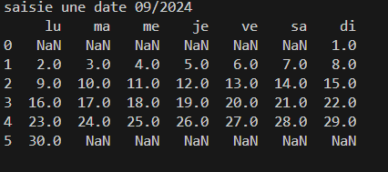
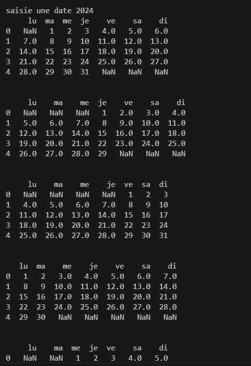

## Description
Ce projet Python génère un calendrier mensuel en fonction du mois et de l'année spécifiés par l'utilisateur. Il affiche le calendrier sous forme de tableau, où chaque jour de la semaine correspond à une colonne. Les jours sont remplis, et les cases vides sont indiquées par des valeurs manquantes (`NaN`).

Le programme utilise les bibliothèques **Pandas** et **NumPy** pour la gestion des données et l'affichage du tableau. De plus, il gère les années bissextiles pour ajuster le mois de février.

## Fonctionnalités
- Saisie manuelle du mois et de l'année.
- Calcul du jour de la semaine pour chaque jour du mois.
- Affichage sous forme de tableau (DataFrame) avec les jours de la semaine en colonnes.
- Gestion des années bissextiles (avec 29 jours en février).
- Possibilité d'afficher tous les mois d'une année.

## Comment utiliser
Le programme prend comme entrée une date sous deux formats possibles :
1. `mm/yyyy` : Affiche le calendrier du mois spécifié.
2. `yyyy` : Affiche les calendriers de tous les mois de l'année spécifiée.

### Exemples
- Entrée : `09/2024`  
  Affiche le calendrier du mois de septembre 2023.
  
  
  
- Entrée : `2024`  
  Affiche les calendriers de tous les mois de l'année 2024.
  
